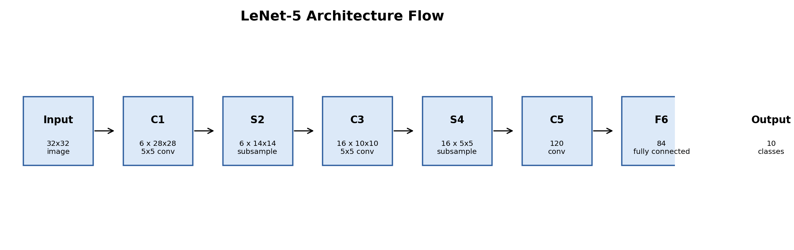

# Paper Review: LeNet-5 and CNN Foundations

## Motivation

Convolutional neural networks are now standard in computer vision, but their ideas were built step by step. This review studies LeNet-5 in context: where CNN ideas came from, what LeNet-5 actually did, and why later deep learning systems were able to extend it.

## Project Goal

We reviewed four papers around the development of CNNs for handwritten recognition:

1. Fukushima, 1980: Neocognitron.
2. LeCun et al., 1989: backpropagation for handwritten ZIP code recognition.
3. LeCun et al., 1998: LeNet-5 and document recognition.
4. Ciresan et al., 2011: GPU-trained deep networks for MNIST.

The aim is to understand the technical line from local receptive fields and hierarchy to trainable convolutional networks and later GPU-scaled neural systems.

## Reviewed Papers

| Paper | Year | What it contributed |
|---|---:|---|
| [Neocognitron](https://doi.org/10.1007/BF00344251) | 1980 | Hierarchical visual recognition with local feature extraction and shift tolerance. |
| [Backpropagation Applied to Handwritten Zip Code Recognition](https://yann.lecun.com/exdb/publis/pdf/lecun-89e.pdf) | 1989 | Backpropagation applied to a constrained handwriting recognition network. |
| [Gradient-Based Learning Applied to Document Recognition](https://yann.lecun.com/exdb/publis/pdf/lecun-98.pdf) | 1998 | LeNet-5 and a practical document recognition system. |
| [Handwritten Digit Recognition with a Committee of Deep Neural Nets on GPUs](https://arxiv.org/abs/1103.4487) | 2011 | GPU scaling and deep model committees for stronger MNIST performance. |

Short one-page notes for each paper are available in `paper_notes/`.

## What The Papers Did

Fukushima's Neocognitron introduced the idea that visual recognition can be built as a hierarchy of local feature detectors and pooling-like stages. It was not LeNet, but it created an important conceptual foundation.

LeCun et al. 1989 showed that backpropagation could train a constrained neural network for real handwritten ZIP code recognition. This moved the field from hand-designed features toward learned feature extraction.

LeCun et al. 1998 presented LeNet-5 as part of a full document recognition system. The model used convolution, subsampling, and dense layers to recognize handwritten digits and characters in practical settings.

Ciresan et al. 2011 showed how later hardware and larger neural systems pushed handwritten digit recognition further. This paper is useful because it shows that LeNet-5 was a foundation, not the final form of CNN progress.

## Architecture Discussion

LeNet-5 processes a 32x32 image through convolution and subsampling stages before classification:

Input -> C1 convolution -> S2 subsampling -> C3 convolution -> S4 subsampling -> C5 -> F6 -> output classes.



The key design idea is locality. Early layers detect small stroke patterns, later layers combine them into more abstract digit representations, and the final layers classify the digit.

## Review Artifacts

The repository includes:

- `review_artifacts/reviewed_papers.csv`
- `review_artifacts/lenet5_architecture_table.csv`
- `review_artifacts/paper_comparison.csv`
- `review_artifacts/lenet5_architecture_flow.png`
- `review_artifacts/neocognitron_concept.png`
- `review_artifacts/zip_code_backprop_pipeline.png`
- `review_artifacts/gpu_committee_pipeline.png`
- `paper_notes/01_fukushima_neocognitron.md`
- `paper_notes/02_lecun_zip_code_backprop.md`
- `paper_notes/03_lecun_lenet5_document_recognition.md`
- `paper_notes/04_ciresan_gpu_digit_recognition.md`

The architecture figure is a flow diagram because architecture is a sequence of transformations, not a single numeric measurement.

## Interpretation

The main lesson from these papers is that CNNs combine three important ideas: local receptive fields, shared weights, and hierarchical feature composition. LeNet-5 is important because it made these ideas practical in an end-to-end trainable system.

## Conclusion

LeNet-5 should be understood as a bridge between early biologically inspired visual models and modern deep CNNs. Its scale is small compared with modern networks, but the design principles are still visible in computer vision today.

## How To Run

```bash
pip install -r requirements.txt
python 1_lenet5_review_tables.py
```
