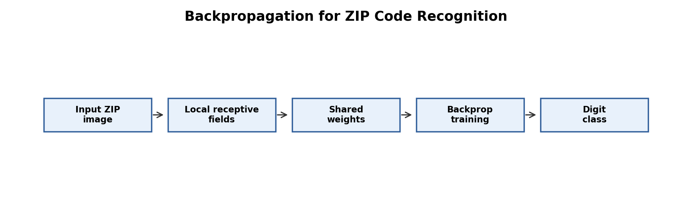

# LeCun et al. 1989: Backpropagation for ZIP Code Recognition

Paper: Yann LeCun et al., "Backpropagation Applied to Handwritten Zip Code Recognition"  
Link: https://yann.lecun.com/exdb/publis/pdf/lecun-89e.pdf

The diagram shows the pipeline idea: handwritten image input, local receptive fields, shared weights, backpropagation training, and final digit classification.

This paper moved neural vision closer to practical use. The authors studied handwritten ZIP code recognition and showed that backpropagation could train a constrained neural network for real image recognition. The important point is that the network was not a generic fully connected model. It used task structure: local receptive fields and shared parameters.

The paper's contribution is the combination of learning and architectural bias. Instead of manually designing all features, the network learned useful representations from examples. At the same time, the architecture used assumptions about images: nearby pixels are related, and the same visual pattern can appear in different positions.

This is a key step toward LeNet because it shows why constrained neural networks can generalize better than unconstrained ones. A model with fewer, better-organized parameters can learn more robust visual features.

The main lesson is that good deep learning is not only about optimization. It is also about choosing architecture that matches the data. For images, local connectivity and weight sharing are strong assumptions.

The limitation is that this was an earlier system and not the full LeNet-5 document recognition pipeline. It should be read as a bridge between early neural recognition and the later 1998 LeNet-5 system.
