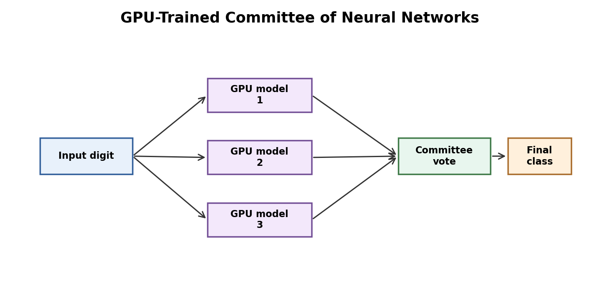

# Ciresan et al. 2011: GPU-Trained Deep Networks for Digit Recognition

Paper: Dan C. Ciresan, Ueli Meier, Luca M. Gambardella, Jurgen Schmidhuber, "Handwritten Digit Recognition with a Committee of Deep Neural Nets on GPUs"  
Link: https://arxiv.org/abs/1103.4487

The diagram shows why the paper is different from LeNet-5: multiple GPU-trained models are combined as a committee before the final class decision.

This paper is useful in a LeNet review because it shows what changed after the original CNN foundations: hardware, scale, and training capacity. The authors used GPU-trained deep neural networks and model committees to achieve very strong MNIST performance.

The paper did not introduce the original CNN idea. Instead, it demonstrated that neural methods could reach higher accuracy when training became faster and models became larger. This matters historically because deep learning progress depended not only on algorithms, but also on compute.

The main lesson is that LeNet established the direction, but later systems improved performance through scale and better training resources. GPU acceleration made it practical to train larger networks and test more powerful model combinations.

For our review, this paper helps prevent a narrow view. LeNet-5 is foundational, but not the endpoint. Modern computer vision grew by combining architectural ideas with better optimization, larger datasets, faster hardware, and stronger experimental practice.

The limitation is that committee methods can improve benchmark accuracy while making systems heavier and less interpretable. This creates a trade-off between raw performance and simplicity.
